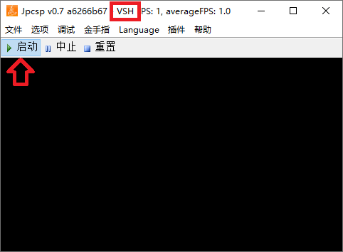
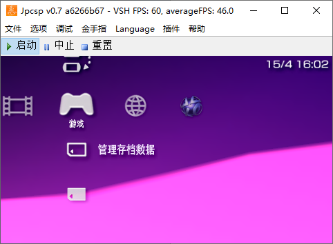
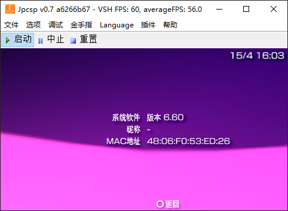

# 在 jpcsp 中运行 6.60 官方固件

| 下载链接 | 备注
| --------- | ---------
| [腾讯微云](https://share.weiyun.com/P9DnNkxa) | jpcsp-a6266b67-windows--vsh-amd64.7z

这个压缩包里的 jpcsp 安装了 6.60 版本的官方固件，通过 start-windows-amd64-vsh.bat 启动 jpcsp，然后点启动按钮：

VSH 模式启动完毕之后，即可在 jpcsp 中看到 PSP 的 XMB 界面：

