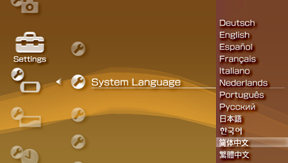
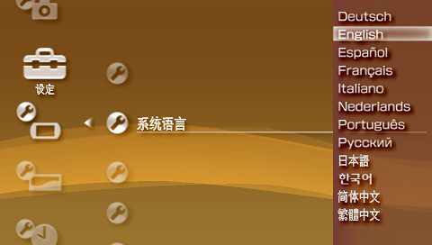

# 系统语言

PSP 支持多语言，下面两个例子分别演示了如何把系统语言设置为简体中文和英文，其他语言以此类推。

## 例1. 英文系统下设置以简体中文显示

菜单路径：**Settings** > **System Settings** > **System Language**

## 例2. 简体中文系统下设置以英文显示

菜单路径：**设定** > **主机设定** > **系统语言**

