# 从存储设备升级

下文将以最新的官方系统版本 6.61 为目标，说明如何从存储设备升级 PSP。

## 步骤 1：下载 6.61 官方固件

以下为本人收集到的一些下载链接，选择其一下载即可：

| 序号 | 下载链接 | 备注
| --------- | --------- | ---------
| 1 | [官方网站](http://du01.psp.update.playstation.org/update/psp/image/us/2014_1212_6be8878f475ac5b1a499b95ab2f7d301/EBOOT.PBP) | SONY Playstation 官网，可靠性最高
| 2 | [百度网盘](https://pan.baidu.com/s/1qtt4ehPEzFX9osqqNJxlkg) | 提取码: tpex
| 3 | [腾讯微云](https://share.weiyun.com/dVIUv7gb) | 在 psp\6.61\ofw 文件夹下

## 步骤 2：拷贝 EBOOT.PBP 到 Memory Stick

下载链接不同，但下载回来的文件是一样的，6.61 官方固件对应的 EBOOT.PBP，大小为 32,580,549 字节，即 31,817 KB。

将 PSP 连接到电脑，把 EBOOT.PBP 拷贝到 Memory Stick 的 PSP\GAME\UPDATE 文件夹，如果文件夹不存在，需要手动创建对应的文件夹。拷贝完毕，断开 PSP 与电脑的连接。

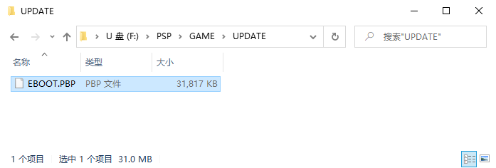

## 步骤 3：按照 3.1 或 3.2 操作，启动升级程序

如果看到以下信息，说明当前系统已经是 6.61 版本，不需要升级：

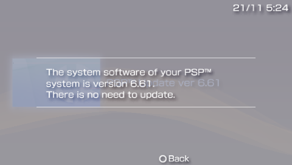

3.1 通过设定菜单启动升级程序

菜单路径：**Settings** > **System Update** > **Update via Storage Media**

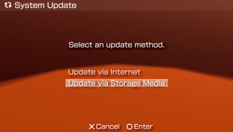

如果步骤 2 操作无误的话，会看到以下信息：

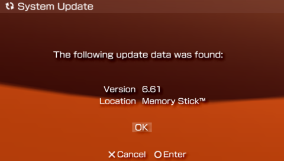

3.2 通过游戏菜单启动升级程序

菜单路径：**Game** > **Memory Stick** > **PSP Update ver 6.61**

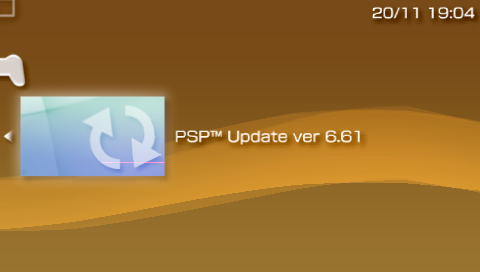

## 步骤 4：按照提示逐步完成系统升级

4.1 下图的开始动画结束之后，PSP 会黑屏一阵子：

4.2 黑屏结束之后，进入系统升级界面：

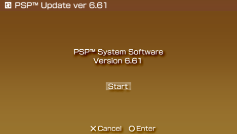

4.3 下图是 PSP 的系统软件使用协议，按向右键继续：

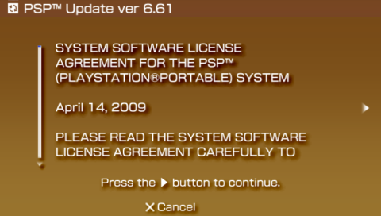

4.4 选择 Accept 之后按向右键继续：

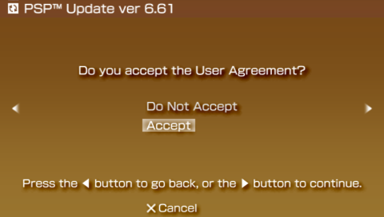

4.5 最后一次温馨提示：升级的操作是不可逆的，在升级的过程中，如果发生断电或者 Memory Stick 松脱的情形，会有变砖的可能。按圆圈键开始升级：

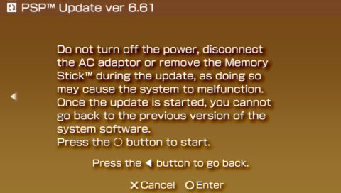

4.6 为了降低 PSP 变砖的风险，如果当前电量不足 50%，升级会暂停：

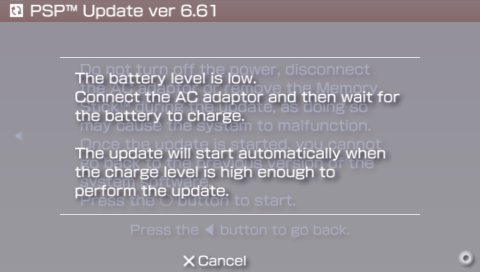

4.7 安全起见，升级的过程中，请保持与 PSP 的距离，耐心等待升级完成：

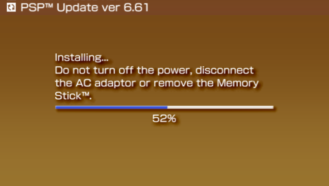

4.8 升级完成后，按圆圈键重启：

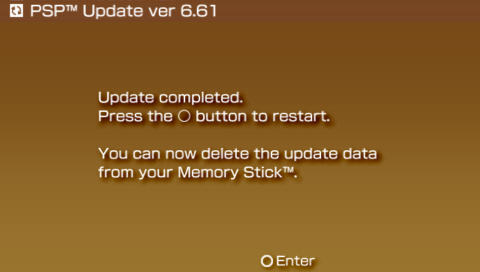

## 步骤 5：确认升级后的系统软件版本

重启之后再去[查看主机信息](../../system-settings/system-information/README.md "不懂查看主机信息的点这里")，可以看到系统已经成功升级为 6.61 版本。

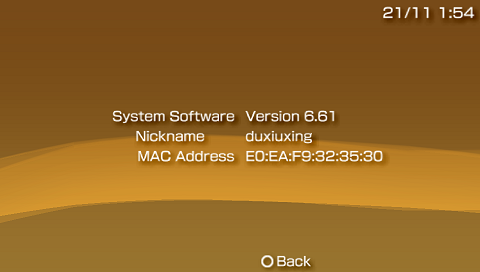

## 步骤 6：删除 Memory Stick 上的 EBOOT.PBP

步骤 2 中拷贝到 Memory Stick 上的 EBOOT.PBP 现在已经没用了，可以在 PSP 中删掉它：

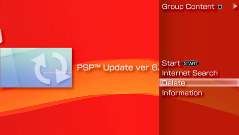
